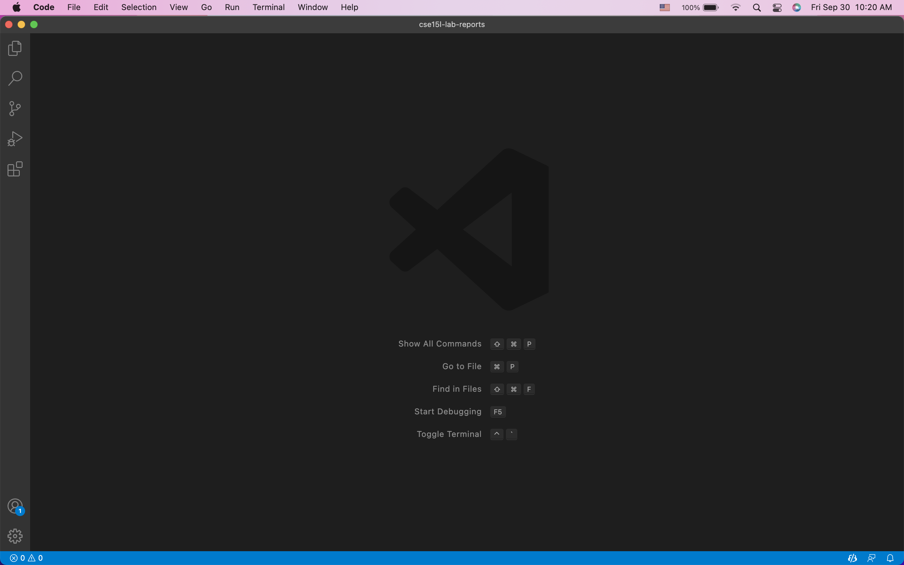
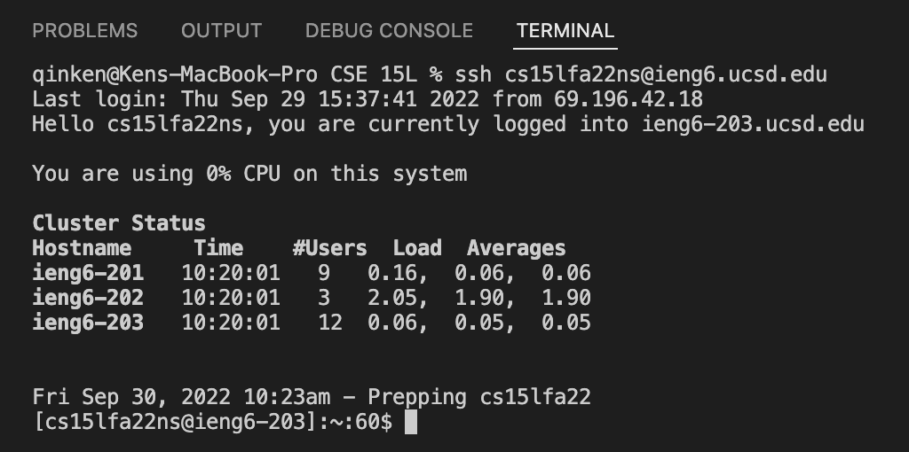
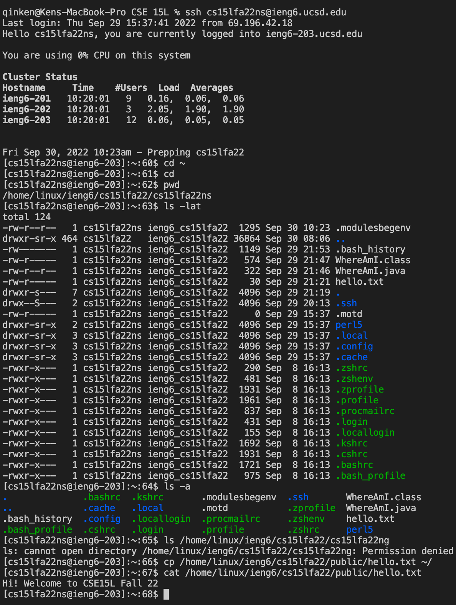
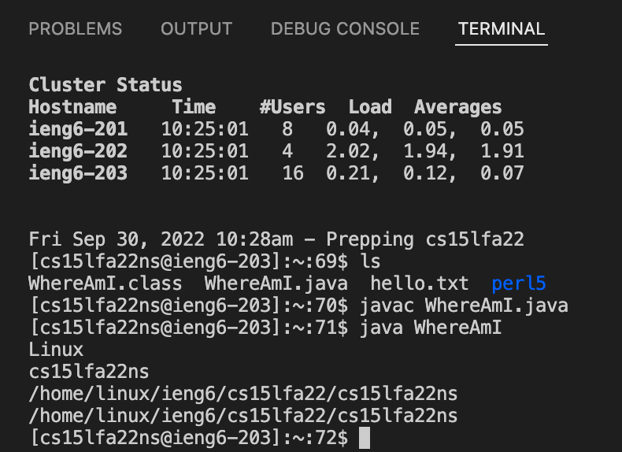
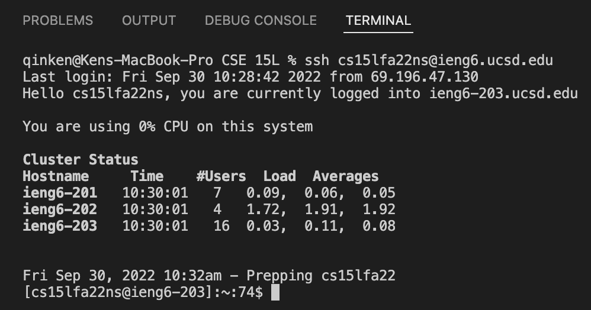

# **Week 1 Lab Report**
> *By Ken Qin*
---
* Step 1: Installing VS Code


My first step is to install the Visual Studio Code on my computer through the website shown above.  
       
Then, I opened up my VS Code and this is the window that shows up.

---
* Step 2: Remotely Connecting


Then, I use the command `ssh cs15lfa22ns@ieng6.ucsd.edu` to connect to the computer in the CSE basement (**the server**)
Note that I was asked to enter a password before, and after I created a pair of SSH keys (in step 5), I was no longer asked to enter a password every time I connect to the server.

---
* Step 3: Trying Some Commands

In this step, I tried running some useful commands provided in my remote terminal. Commands such as `cd`, `pwd`, `ls`, `cat` were all included.

(`cd`: stands for "change directory", allows user to move between directories. 
`pwd`: stands for "print working directory", it prints out the full path name of your current directory.
`ls`: this command lists all files in the current directory.
`cat`: short for "concatenate", can concatenate files and is frequently used as terminal command.)

With a lot of them tell me about the information of the directory or the information of files on the remote computer.

---
* Step 4: Moving Files with `scp`


This screenshot demonstrates the different parts of the scp command. 
The first part is our command `scp`, which copies files to the remote server. Then, the next part is `WhereAmI.java`, the file name of what we try to copy. Lastly, `cs15lfa22ns@ieng6.ucsd.edu:~/` is my username and path. Notice that everybody's username is different. If you want to remotely copy the file, make sure to change `ns` in my username to whatever username you have to login to your account.



In this step, I want to copy `WhereAmI.java` file to `ssh`. I first compile the program on my computer, and it prints out the information about the client using `getProperty` function, which shows my computer running on **Mac OS**. Then, I log in to `ssh` and use ls to see that the file was indeed copied to my directory. I run in ssh and it prints out the information about the server, which is the remote computer running on **Linux**. 

---
* Step 5: Setting an SSH Key


Now, I use the `ssh-keygen` command on my local terminal to create a pair of ssh keys. I then use the command 
```
scp /Users/kenqin/.ssh/id_rsa.pub cs15lfa22ns@ieng6.ucsd.edu:~/.ssh/authorized_keys
```
to copy the public key onto the server, allowing me to connect remotely without having to enter my extremely long password every time. 

---
* Step 6: Optimizing Remote Running

Lastly, I optimize my remote running with two split terminals. The left one is on the local while the right one is on the remote. I use copy-paste and up-arrow to retrieve previous commands, so reducing my overall keystrokes to very few. Successfully reducing the time spend on typing out all the commands. 