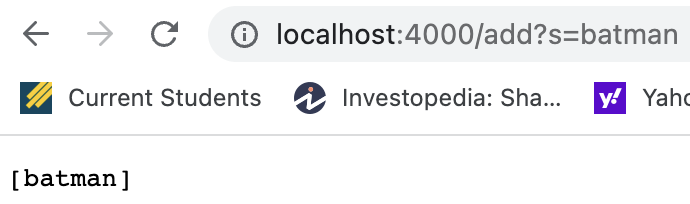
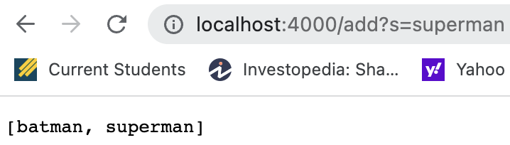
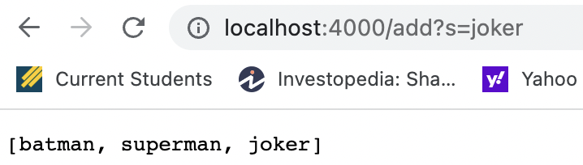
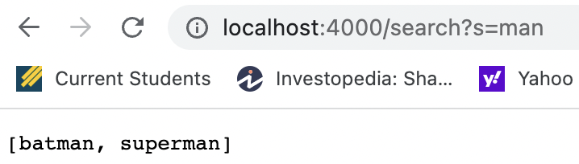
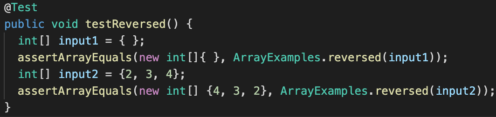
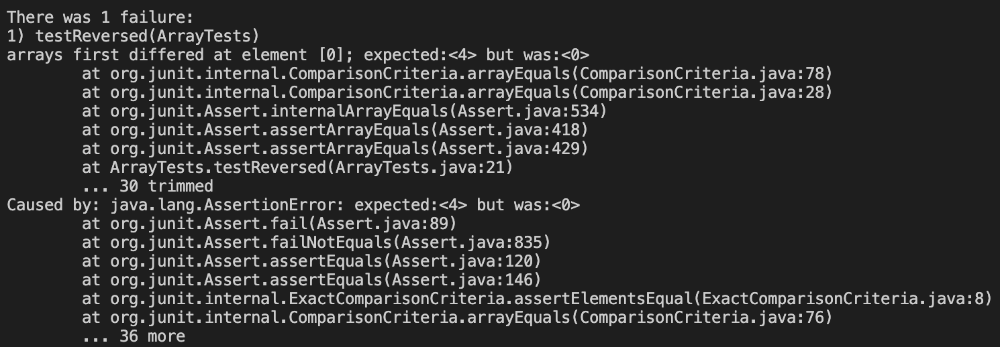
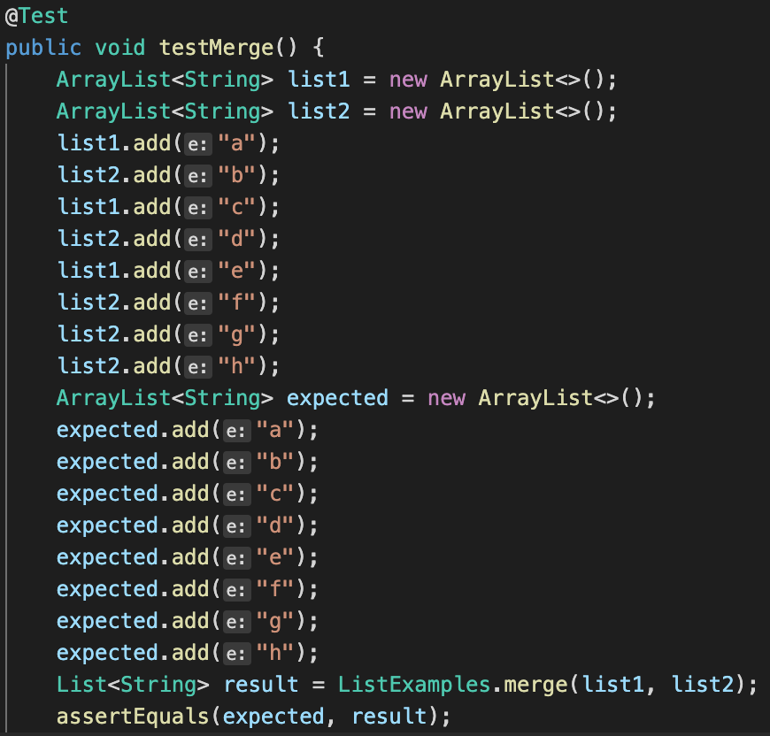
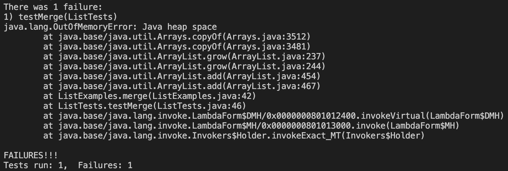

# **Week 3 Lab Report**
> *By Ken Qin*
---
* Part 1: Simplest Search Engine

```
import java.io.IOException;
import java.net.URI;
import java.util.ArrayList;

class Handler implements URLHandler {
    // The one bit of state on the server: a number that will be manipulated by
    // various requests.
    int num = 0;
    // initialize two arraylists for adding and querying //
    ArrayList<String> list = new ArrayList<>();
    ArrayList<String> query_list = new ArrayList<>();

    public String handleRequest(URI url) {
        if (url.getPath().equals("/")) {
            return String.format("Number: %d", num);
        }
        else {
            System.out.println("Path: " + url.getPath());
            // adding new strings to the list //
            if (url.getPath().contains("/add")) {
                String[] parameters = url.getQuery().split("=");
                if (parameters[0].equals("s")) {
                    list.add(parameters[1]);
                    return list.toString();
                }
            }
            // querying the list and searching for substrings //
            if (url.getPath().contains("/search")) {
                String[] parameters = url.getQuery().split("=");
                if (parameters[0].equals("s")) {
                    for (String s: list) {
                        if (s.contains(parameters[1])) {
                            query_list.add(s);
                        }
                    }
                    return query_list.toString();
                }
            }
            return "404 Not Found!";
        }
    }
}

class SearchEngine {
    public static void main(String[] args) throws IOException {
        if(args.length == 0){
            System.out.println("Missing port number! Try any number between 1024 to 49151");
            return;
        }

        int port = Integer.parseInt(args[0]);

        Server.start(port, new Handler());
    }
}
```
Above, we have the code for `SearchEngine.java`, a java file that supports adding and querying string lists based on paths on the 
web server. Now, I will demonstrate how this search engine works by showing the URLs and the response on the website.


In the screenshots, we called the `handleRequest` method, which takes in an URL argument and perform different actions based on the URL. In this case, the `/add` conditional runs and adds strings "batman", "superman" to the `ArrayList<String> list` that was created in the `Handler` class. The value of the `list` changed from an empty ArrayList to one that contains two elements, as demonstrated in the screenshot above.

We can use the same idea to add more elements to the list. In this screenshot, `handleRequest` method is called again, and takes in an URL argument. The method runs on `/add` conditional and adds the string "joker" to the list, which is appearing after `=` in the URL. The value of the `list` changed from two elements to three elements when the request is done processing. 

In this screenshot, the method `handleRquest` is called with an URL argument. This time, the method runs on `/search` conditional and searches through the list that was created above. Then using a for loop and using `.contains` to whether check each string contains to substring "man" or not, the method is able to querying through the list. Afterwards, I use another list `ArrayList<String> query_list` to store all the elements that contains that substring, which is the querying result. In this example, the value of the `query_list` changes from 0 element to 2 elements after the request is done processing.

---
* Part 2: Finding Bugs

In this part, we will focus on testing and dealing with bugs.
- The failure-inducing input:

`input2` in this test is the failure-inducing input.
- The symptom:

Above shows the failing test output, which is expected: <4> but was: <0>.
- The bug: 
```
  // Returns a *new* array with all the elements of the input array in reversed
  // order
  static int[] reversed(int[] arr) {
    int[] newArray = new int[arr.length];
    for(int i = 0; i < arr.length; i += 1) {
      arr[i] = newArray[arr.length - i - 1]; // the bug //
    }
    return arr;
  }
  ```
In this method, the bug is found at line 4, which states `arr[i] = newArray[arr.length - i - 1];` the bug here is that the `arr[i]` values are set to the values in `newArray`, which is an empty array. We can fix this with the following code:
```
  static int[] reversed(int[] arr) {
    int[] newArray = new int[arr.length];
    for(int i = 0; i < arr.length; i += 1) {
      newArray[i] = arr[arr.length - i - 1]; // the fix //
    }
    return newArray;
  }
```
which sets values in `newArray` to those in `arr`, and then return `newArray`, allowing the list to be reversed. 

The bug caused the symptom to output <0> for the first element, since the values of the `newArray` was defaulted to 0. The bug caused the output to be `{0, 0, 0`} where it should actually be `{4, 3, 2}`, with the first element being <4>.

---

On a different file:
- The failure-inducing input: 

the two arraylists, result and expected shows the failure-inducing input.
- The symptom:

Here, we see a OutOfMemoryError from Java, which is likely a result of an infinite loop. 
- The bug: 
```
  static List<String> merge(List<String> list1, List<String> list2) {
    List<String> result = new ArrayList<>();
    int index1 = 0, index2 = 0;
    while(index1 < list1.size() && index2 < list2.size()) {
      if(list1.get(index1).compareTo(list2.get(index2)) < 0) {
        result.add(list1.get(index1));
        index1 += 1;
      }
      else {
        result.add(list2.get(index2));
        index2 += 1;
      }
    }
    while(index1 < list1.size()) {
      result.add(list1.get(index1));
      index1 += 1;
    }
    while(index2 < list2.size()) {
      result.add(list2.get(index2));
      index1 += 1;                      // the bug //
    }
    return result;
  }
```
The bug here is that `index1` is incremented each time in the while loop instead of `index2`, which causes an infinite while loop, since `index2` was never incremented. We can fix this with the following code: 
```
    while(index2 < list2.size()) {
      result.add(list2.get(index2));
      index2 += 1;  // the fix //
    }
```
which increments `index2` each time in the loop and properly merge the list without running the loop forever. 

This bug caused the symptom to be a OutOfMoemoryError from Java. Since inside the while loop, the wrong index `index1` was incremented, the input inside the while loop was never incremented. Causing the output to be infinite where it should actually return a merged list.
