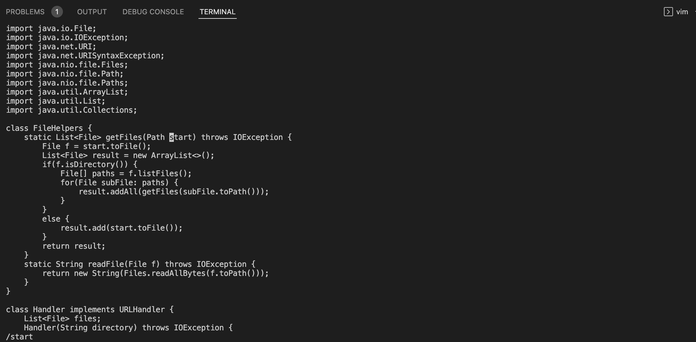
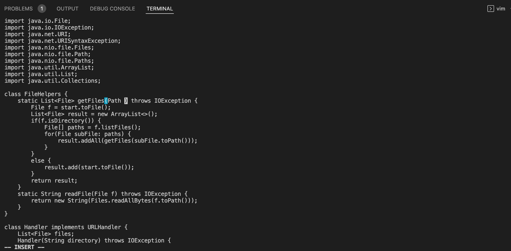
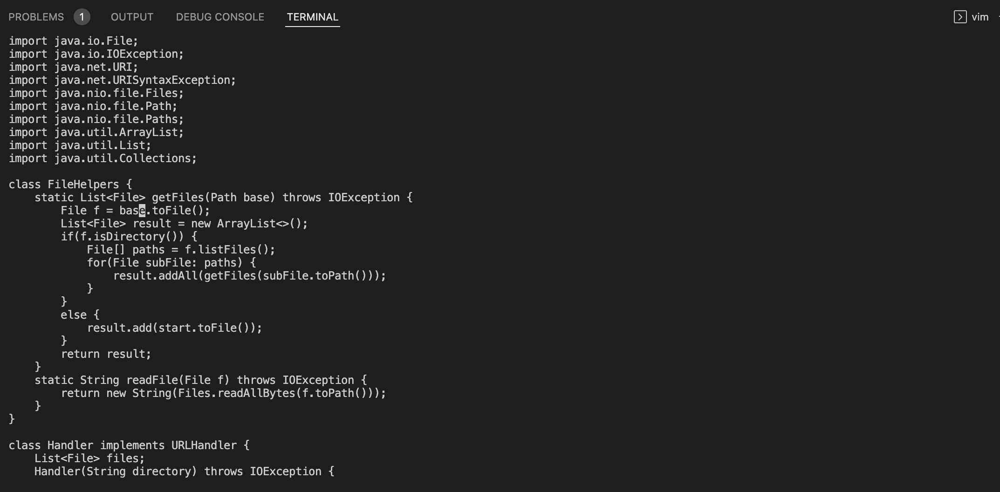
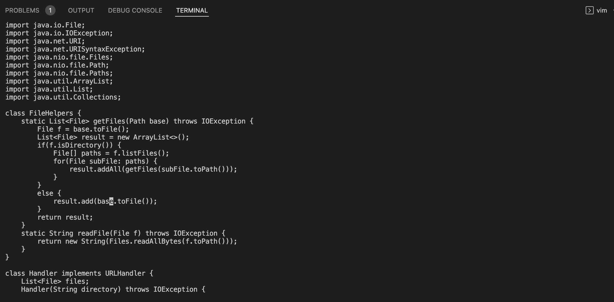
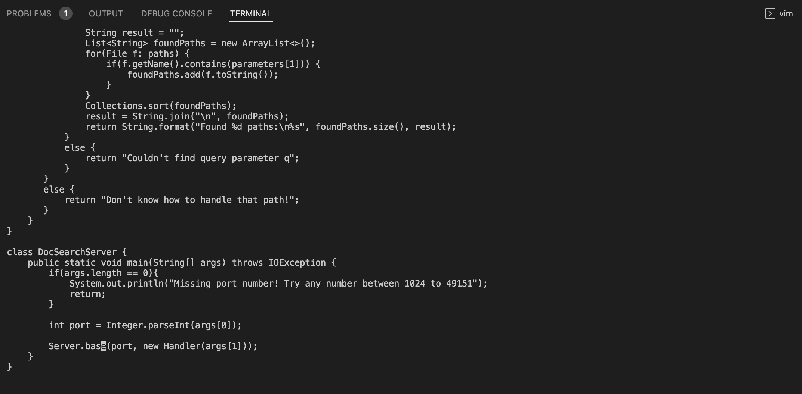
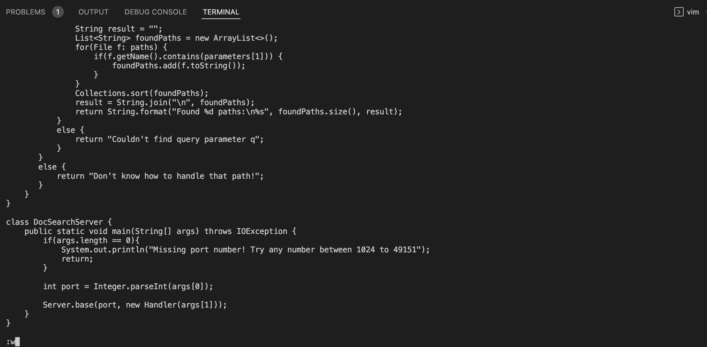
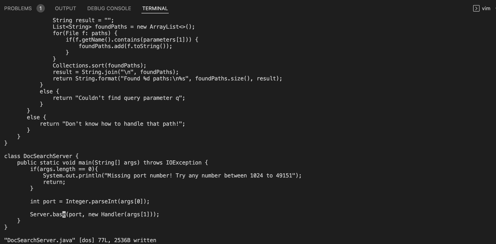
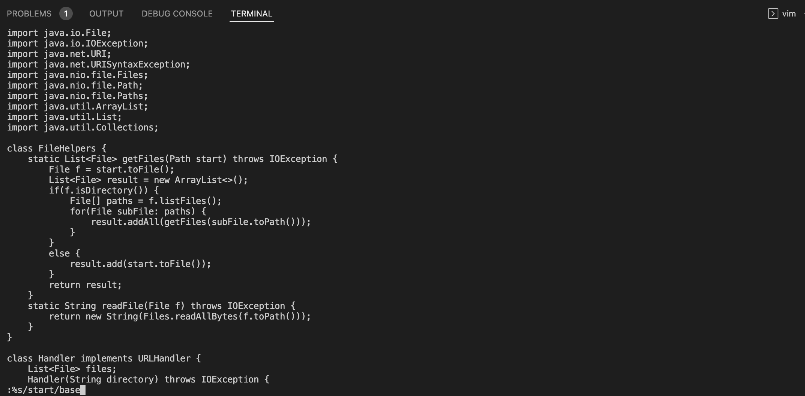
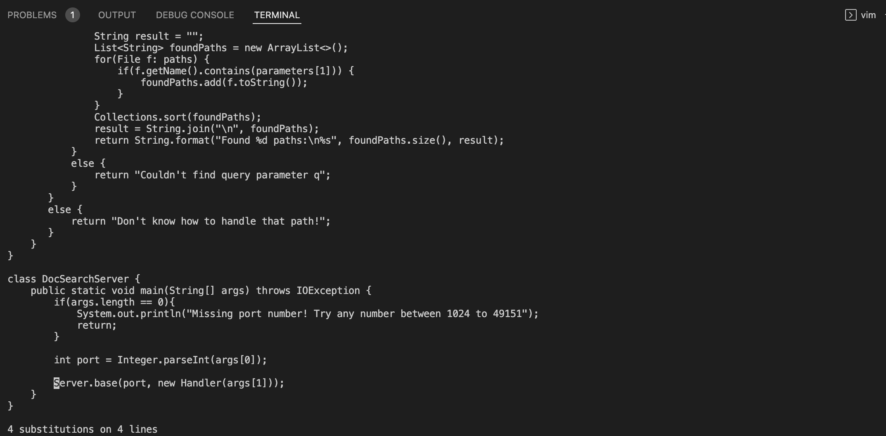

# **Week 7 Lab Report**
> *By Ken Qin*
---
* Part 1: Vim Commands

We want to change the name of the `start` parameter and its uses to `base`, here is how we do it in Vim.

First, we need to change our directory and run the file on Vim using these commands:       
`cd week6-skill-demo1<Enter>`
`vim DocSearchServer.java<Enter>`
Then, we can perform the following Vim commands to change the name:
`/start<Enter>cebase<Esc>n.n.n.:w<Enter>`

This screenshot shows the results of performing `/start<Enter>` in Vim, which moves cursor to `start`.

This screenshot shows the results of `ce`, which switches to input mode and delete the word `start`.

This screenshot shows typing `base<Esc>`, replacing the text and returning to insert mode.

These screenshots show using `n.` to change each occurence of `start` to `base`, which repeats for last search from cursor and uses `.` to perform previous command of replacing word.

Lastly, these two screenshots display the results of using `:w<Enter>` to save the changes to the file.

---
**Special Note**: Alternatively, an easy way to find and replace in the entire file using Vim is the following command: 
`:%s/start/base<Enter>:w<Enter>`, where `%s` is the range representing the entire file, `start` is the pattern we want to replace, and `base` is the string we want to replace with.

Above shows this alternative way of find and replace all, with this useful Vim command not covered in lectures.

---
* Part 2: Workflow Strategies

Which of these two styles would you prefer using if you had to work on a program that you were running remotely, and why?

I would 

What about the project or task might factor into your decision one way or another? (If nothing would affect your decision, say so and why!)