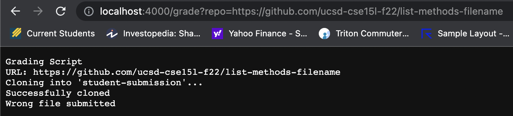

# **Week 9/10 Lab Report**
> *By Ken Qin*
---
 * Grading Script


 ```
# Create your grading script here

# set -e // dont run errors

echo "Grading Script"
echo "URL: $1"

rm -rf student-submission
git clone $1 student-submission

if [ $? -eq 0 ]
then 
    echo "Successfully cloned"
else 
    echo "Clone failed"
    exit 1
fi

cd student-submission
file_name="ListExamples.java"
if [ -e $file_name ]
then
    echo "Correct file found: ($file_name)"
else 
    echo "Wrong file submitted"
    exit 1
fi

CP=".:../lib/hamcrest-core-1.3.jar:../lib/junit-4.13.2.jar"
cp ../TestListExamples.java .
javac -cp $CP *.java 2> compilation_error.txt

if [ $? -eq 0 ]
then 
    echo "Compilation succeed"
else 
    message=`cat compilation_error.txt`
    echo "Compilation failed: ($message)"
    exit 1
fi

rm -rf test_result.txt
java -cp $CP org.junit.runner.JUnitCore TestListExamples > test_result.txt

if [ $? -eq 0 ]
then 
    result_pass=`cat test_result.txt | grep "OK"`
    echo "[TESTS PASSED] JUnit result: " $result_pass
else 
    result_fail=`cat test_result.txt | grep "Tests run:"`
    echo "[TESTS FAILED] JUnit result: " $result_fail
    exit 1
fi
```


Above is my `grade.sh` grading script that aims to evaluate student submissions.



Above shows three different "student" submissions and their reported grade loaded in the browser. 

For the second screenshot, it produces no *standard output*, but produces the *standard error* message "ListExamples.java:15: error: ';' expected
        result.add(0, s)
                        ^
1 error", which is stored in the file `compilation_error.txt`. The *return code* is non-zero for this command, since there is a compile error with the student submission, the *return code* would not be zero.

For each line with an if statement, we can see that on line 11, the condition would be true. Since the return code is still 0 at this point, indicating the student submission URL is successfully cloned. On line 21, the codition is still true, since the file name is correct for our student submission. Then, on line 33, here we have our compile error and the return code is no longer 0. The if statement is false, since our return code no longer equals 0.

For each line that does not run, we can see that from line 14-16, since the student submission is successfully cloned, the if statement is true, the `then` branch will run and the `else` branch will not run. From line 24-26, the same reason goes for the if statement checking the file name. Since the `then` branch of the if statement runs, the `else` branch will not run. Then, line 34-35 will not run, since we have a compile error, the `else` branch of the if statement runs and the `then` branch does not run. At this point, the rest of the lines will not run, since we are exiting early when the student submission gives a compile error.
